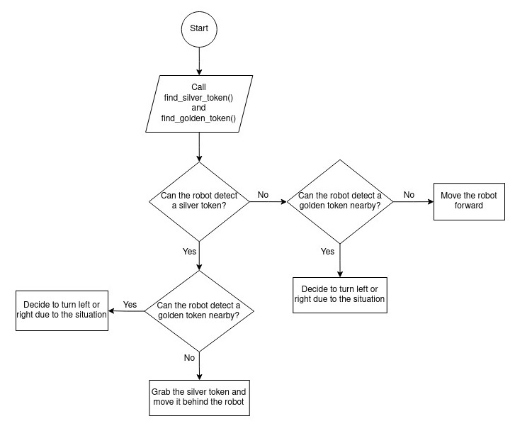

Python Robotics Simulator
================================

This is a project that simulates obstacle avoidance and the main script of this project is [assignment_1.py](robot-sim/assignment_1.py).

In this project we use a simple and portable robot simulator developed by [Student Robotics](https://studentrobotics.org).


Description
----------------------

In this simulator, we have a mobile robot that can detect boxes around all directions (from -180.0 degrees to 180.0 degrees).

The [assignment_1.py](robot-sim/assignment_1.py) is a python script that achieves the following behaviors for the robot:
- Constantly drives the robot around the circuit in the counter-clockwise direction
- Avoid touching the golden boxes
- When the robot is close to a silver box, it should grab it, and move it behind itself  


Installing and Running
----------------------

The simulator requires a Python 2.7 installation, the [Pygame](http://pygame.org/) library, [PyPyBox2D](https://pypi.python.org/pypi/pypybox2d/2.1-r331), and [PyYAML](https://pypi.python.org/pypi/PyYAML/).

Once the dependencies are installed, simply run the code below in the terminal to test out the simulator:

```bash
$ python2 run.py assignment_1.py
```


Result of the Simulation
----------------------

Follow the link below to see the result of the simulation:

[Result of the Simulation](https://youtu.be/ZF0z2ONHWJQ)


Flowchart
----------------------

The flowchart of the [assignment_1.py](robot-sim/assignment_1.py) script in one loop is like:




Psuedocode
----------------------

```
function to find the closest silver token where is located in front of the robot:
    for tokens that robot sees:
        if the token is in front of the robot and it's also silver then:
            get the distance and the angle of that silver token
    if the robot couldn't see any silver token then:
        return value -1 for the distance and the angle
    else:
        return the distance and the angle of the closest silver token

==================================================================================================================================

function to find golden tokens in front, right side and left side of the robot and the closest of them in mentioned directions:
    for tokens that robot sees:
        if the token is in front of the robot and it's also golden then:
            store the distance and the angle of them in the specified dictionary
        else if the token is in right side of the robot and it's also golden then:
            store the distance and the angle of them in the specified dictionary
        else if the token is in left side of the robot and it's also golden then:
            store the distance and the angle of them in the specified dictionary
    if the robot saw any golden token in front of the robot then:
        get the distance and the angle of the closest of them 
    if the robot saw any golden token in right side of the robot then:
        get the distance and the angle of the closest of them
    if the robot saw any golden token in left side of the robot then:
        get the distance and the angle of the closest of them 
    return the dictionaries and the distance of the closet golden tokens in front, right side and left side of the robot

==================================================================================================================================

while true:
    call the mentioned functions
    if there isn't any silver token nearby then:
        if there isn't any golden token nearby then:
            move the robot forward
        else:
            if numbers of golden token in right side of the robot is fewer than the left side of it then:
                turn right
            else if numbers of golden token in left side of the robot is fewer than the right side of it then:
                turn left
            else:
                while there is a golden token in front of the robot and also nearby:
                    call the function for finding golden tokens
                    if the distance of the closest golden token in right side of the robot is more than the distance of the closest golden token in left side of the robot then:
                        turn right
                    else if the distance of the closest golden token in left side of the robot is more than the distance of the closest golden token in right side of the robot then:
                        turn left
    else:
        if there isn't any golden token nearby then:
            if the angle between the silver token and the robot is more than the specified threshold then:
                turn right
            else if the angle between the silver token and the robot is fewer than the minus of the specified threshold then:
                turn left
            else:
                if the silver token isn't nearby then:
                    move the robot forward
                else:
                    grab the silver token and move it behind the robot
        else:
            if numbers of golden token in right side of the robot is fewer than the left side of it then:
                turn right
            else if numbers of golden token in left side of the robot is fewer than the right side of it then:
                turn left
            else:
                while there is a golden token in front of the robot and also nearby:
                    call the function for finding golden tokens
                    if the distance of the closest golden token in right side of the robot is more than the distance of the closest golden token in left side of the robot then:
                        turn right
                    else if the distance of the closest golden token in left side of the robot is more than the distance of the closest golden token in right side of the robot then:
                        turn left             
```